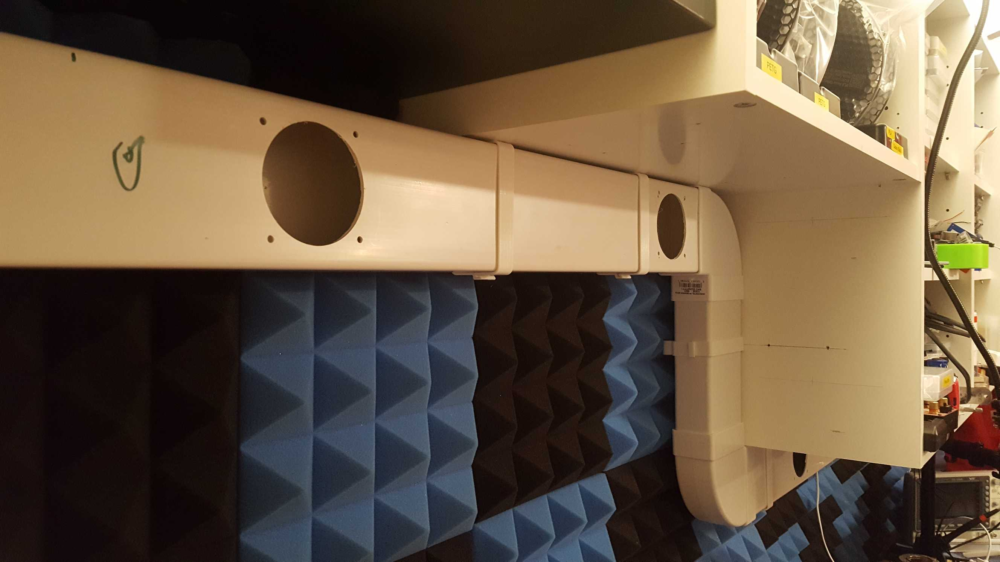
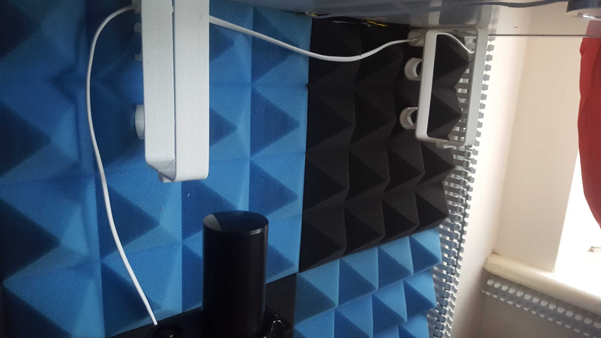

# Vertical Duct Bracket for 100mm Flat Ducting

A mounting bracket for [Manrose 100mm flat channel ducting](https://www.diy.com/departments/manrose-white-flat-channel-ducting-l-1m-dia-100mm/257070_BQ.prd) 
to allow the ducting to be hung down from a cupboard / bench / ceiling.

Includes clip at the bottom to prevent the print opening up and releasing the duct.

Two versions are available:

* VerticalDuctBracket-Simple.stl - a simple bracket
* VerticalDuctBracket-WithHooks.stl - Includes 3 hooks on one side for cables to be run along with the duct.

[Available on Thingiverse](https://www.thingiverse.com/thing:4170071)